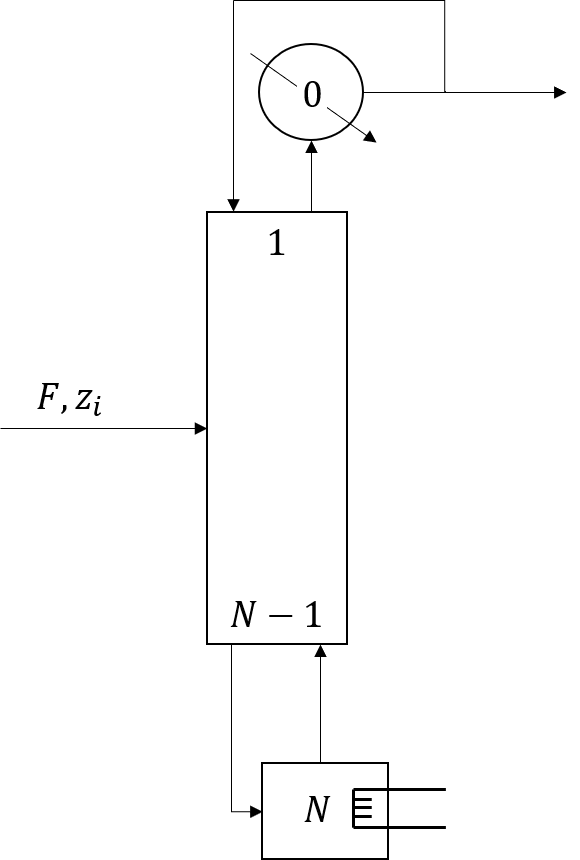

Distillation
============
Perform a calculation for distillation of mixtures
of chemical compounds.

Currently only supports configurations with total condensers and partial reboilers.
Equilibrium data currently only comes from DePriester charts
and is assumed to only depend on pressure and temperature.

Documentation
=============
The online documentation can be found here_.

.. _here: https://dejac001.github.io/distillation/
